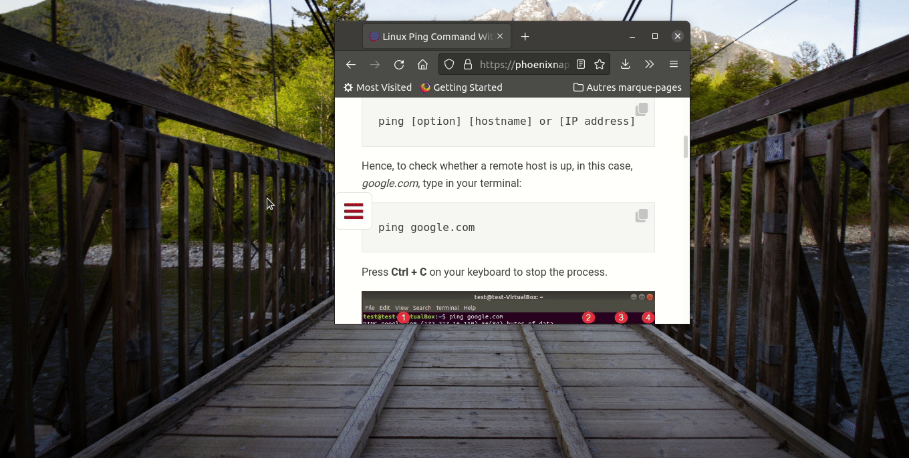

# toter
Run selected text into a gnome terminal

</img>

# example
Once a text is selected somewhere, run:

`
toter -r
`

# install
## debian

`
sudo dpkg -i toter_1.0.1.deb
`

## other
Script is in usr/bin
install xsel as dependency

# keyboard shortcut
Having a keyboard shortcut running `toter -r` allows to have it more avaliable
